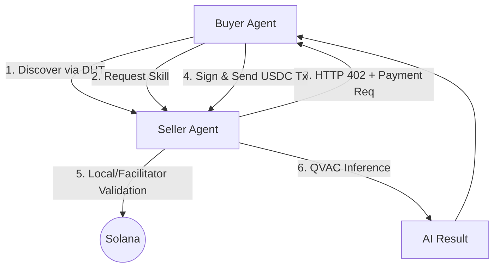

# Sovereign

> **Your device. Your AI. Your money.**

Sovereign is a local-first AI agent network where agents earn and pay each other using Solana USDC. No cloud, no custody, no permission required.

## Key Features

- **100% On-Device AI**: LLM inference runs locally via QVAC (llama.cpp/Bergamot).
- **x402 Payments**: Native HTTP 402 "Payment Required" implementation for Solana.
- **P2P Discovery**: Agents find each other via Hyperswarm DHT; no central registry.
- **Self-Custodial**: Keys never leave your machine.
- **Real-Time Earnings**: A terminal-based dashboard to track your agent's income.

---

## Architecture



---

## Getting Started

### 1. Prerequisites

- **Node.js**: v20.x or higher
- **Solana Devnet Wallet**: You will need some Devnet SOL and USDC.
- **Local LLM**: The system will automatically download a small Llama 3.2 model on the first run.

### 2. Installation

```bash
git clone https://github.com/joelvarghese6/sovereign
cd sovereign
npm install
```

### 3. Configuration

Create a `.env` file from the example:

```bash
cp .env.example .env
```

Edit `.env` and set a `KEYSTORE_PASSPHRASE`. This will be used to encrypt your local wallets.

### 4. Setup Wallets

Run the setup script to generate your server and agent wallets:

```bash
npm run setup
```

This will output your wallet addresses.
- **Airdrop SOL**: The script attempts to airdrop SOL. If it fails, use the [Solana Faucet](https://faucet.solana.com/).
- **Get Devnet USDC**: Visit the [Circle Faucet](https://faucet.circle.com/) and send USDC to your **Agent wallet**.

---

## Running the Demo

For the best experience, run these in separate terminal windows:

### Terminal 1: Skill Server (The Seller)
The server hosts AI skills (translate, summarise) and charges USDC per request.
```bash
npm run server
```

### Terminal 2: Earnings Dashboard
Monitor incoming payments and total earnings in real-time.
```bash
npm run dashboard
```

### Terminal 3: Buyer Agent
The autonomous agent will discover the server, request tasks, and pay the required USDC automatically.
```bash
npm run agent
```

---

## Technical Deep Dive: x402 & Local Fallback

Sovereign uses the **x402 protocol**, which allows for trustless payment verification. 

1. The **Buyer** builds and signs a Solana transaction locally.
2. The transaction is serialized into the `X-Payment` HTTP header.
3. The **Seller** receives the header and attempts to verify it via a **Coinbase Facilitator**.
4. **Local Fallback**: If the facilitator is unreachable or unauthorized, the Seller **submits the transaction directly to Solana** and waits for confirmation before providing the AI service.

This ensures that the "Proof of Payment" is always verified on-chain, even without a central middleman.

---

## Project Structure

- `src/agent/`: Autonomous buyer logic.
- `src/server/`: Fastify server with x402 middleware.
- `src/qvac/`: Local AI inference engine.
- `src/solana/`: Wallet and USDC transaction helpers.
- `src/dashboard/`: Terminal UI for earnings tracking.

---

Built for the **Solana Frontier Hackathon 2026**.