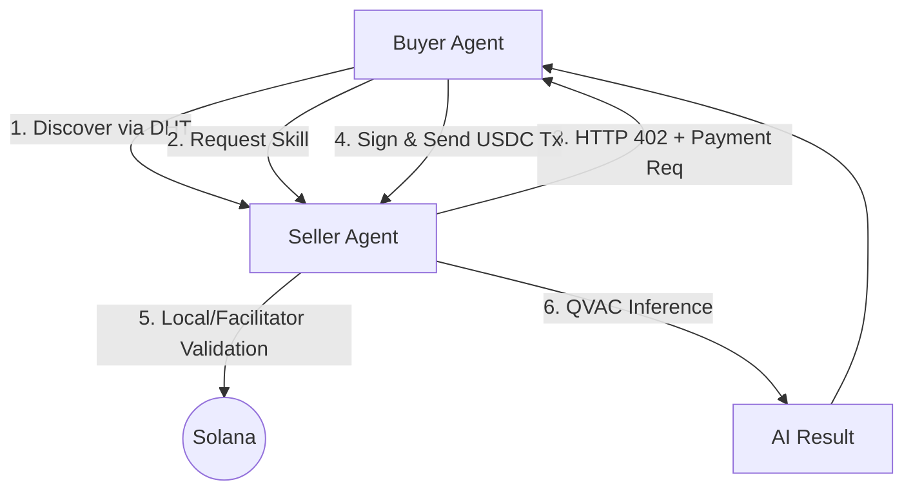

# Sovereign
> **Your device. Your AI. Your money.**

Sovereign is a local-first AI agent network where agents earn and pay each other using Solana USDC. No cloud, no custody, no permission required.

## Key Features
- **100% On-Device AI**: LLM inference runs locally via QVAC (llama.cpp/Bergamot).
- **x402 Payments**: Native HTTP 402 "Payment Required" implementation for Solana.
- **P2P Discovery**: Agents find each other via Hyperswarm DHT; no central registry.
- **Self-Custodial**: Keys never leave your machine.
- **Real-Time Earnings**: A terminal-based dashboard to track your agent's income.

---

## Architecture



---

## Getting Started

### 1. Prerequisites
- **Node.js**: v20.x or higher
- **Solana Devnet Wallet**: You will need some Devnet SOL and USDC.
- **Local LLM**: The system will automatically download a small Llama 3.2 model on the first run.

### 2. Installation
```bash
git clone https://github.com/joelvarghese6/sovereign
cd sovereign
npm install
```

### 3. Configuration
Create a `.env` file from the example:
```bash
cp .env.example .env
```
Edit `.env` and set a `KEYSTORE_PASSPHRASE`. This will be used to encrypt your local wallets.

### 4. Setup Wallets
Run the setup script to generate your server and agent wallets:
```bash
npm run setup
```

This will output your wallet addresses.
- **Airdrop SOL**: The script attempts to airdrop SOL. If it fails, use the [Solana Faucet](https://faucet.solana.com/).
- **Get Devnet USDC**: Visit the [Circle Faucet](https://faucet.circle.com/) and send USDC to your **Agent wallet**.

---

## Running the Demo

For the best experience, run these in separate terminal windows:

### Terminal 1: Skill Server (The Seller)
The server hosts AI skills (translate, summarise) and charges USDC per request.
```bash
npm run server
```

### Terminal 2: Earnings Dashboard
Monitor incoming payments and total earnings in real-time.
```bash
npm run dashboard
```

### Terminal 3: Buyer Agent
The autonomous agent will discover the server, request tasks, and pay the required USDC automatically.
```bash
npm run agent
```

---

## Troubleshooting

### `libatomic.so.1: cannot open shared object file`

This error appears on Linux systems that are missing the `libatomic` system library, which is required by QVAC's native bindings.

**Fix:**
```bash
sudo apt-get update
sudo apt-get install -y libatomic1
```

Then restart the server:
```bash
npm run server
```

**If the error persists**, install the full build toolchain:
```bash
sudo apt-get install -y libatomic1 libc6 libstdc++6 build-essential
npm rebuild
npm run server
```

---

### `bigint: Failed to load bindings, pure JS will be used`

This is a warning, not a fatal error. It means native bigint bindings are not compiled for your platform and a slower JavaScript fallback is being used. The project will still work correctly.

To silence the warning and restore native performance:
```bash
npm rebuild
npm run server
```

If `npm rebuild` fails, install build tools first:
```bash
sudo apt-get install -y build-essential python3
npm rebuild
```

---

### `RPC_INIT_TIMEOUT: RPC initialization timed out after 30000ms`

This error usually appears alongside the `libatomic.so.1` error above. The QVAC worker process fails to start because of the missing library, which causes the RPC connection to time out.

**Fix the root cause first:**
```bash
sudo apt-get install -y libatomic1
npm run server
```

---

### Airdrop returns 429 Too Many Requests

The public Solana devnet faucet has rate limits. This is not an error — your wallets may already have enough SOL.

**Check your balances:**
```bash
npm run setup
```

If balances are above 1 SOL, you have enough to run the demo. If you need more SOL, use the [Solana Faucet](https://faucet.solana.com/) directly.

---

### Hyperswarm shows "No peers found — falling back to localhost"

This is expected when both the server and agent are running on the same machine. Hyperswarm DHT bootstrap takes 15–25 seconds. The fallback to localhost ensures the agent always connects and the demo always works.

When running across two separate machines on the same network, peer discovery will succeed automatically.

---

### Server and agent wallets show zero USDC balance

The agent needs devnet USDC to pay for AI skills. Get it from the [Circle Faucet](https://faucet.circle.com/):
1. Select network: **Solana Devnet**
2. Paste your **agent wallet address** (printed by `npm run setup`)
3. Request USDC — you will receive 10 USDC instantly

---

## Technical Deep Dive: x402 & Local Fallback

Sovereign uses the **x402 protocol**, which allows for trustless payment verification.

1. The **Buyer** builds and signs a Solana transaction locally.
2. The transaction is serialized into the `X-Payment` HTTP header.
3. The **Seller** receives the header and attempts to verify it via a **Coinbase Facilitator**.
4. **Local Fallback**: If the facilitator is unreachable or unauthorized, the Seller **submits the transaction directly to Solana** and waits for confirmation before providing the AI service.

This ensures that the "Proof of Payment" is always verified on-chain, even without a central middleman.

---

## Project Structure

- `src/agent/`: Autonomous buyer logic.
- `src/server/`: Fastify server with x402 middleware.
- `src/qvac/`: Local AI inference engine.
- `src/solana/`: Wallet and USDC transaction helpers.
- `src/dashboard/`: Terminal UI for earnings tracking.

---

Built for the **Solana Frontier Hackathon 2026**.